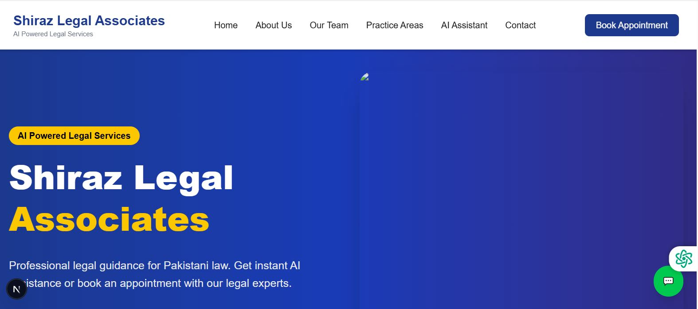
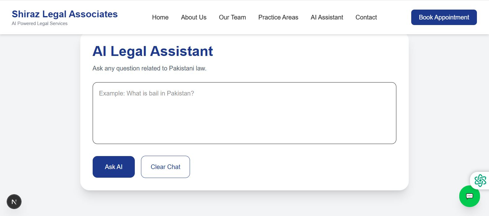
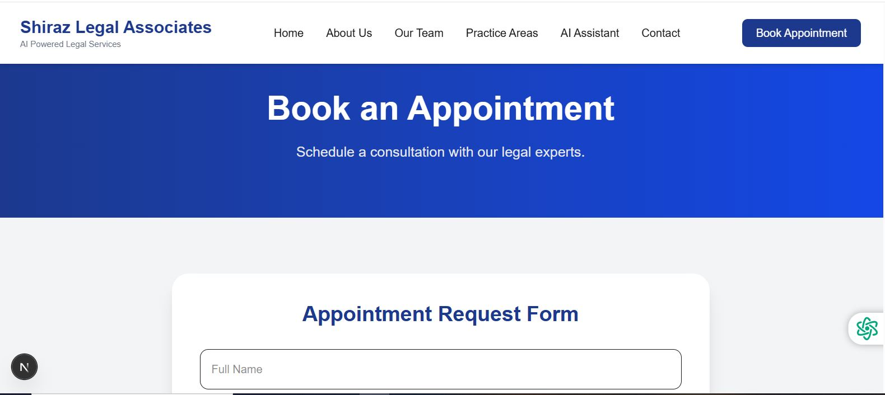
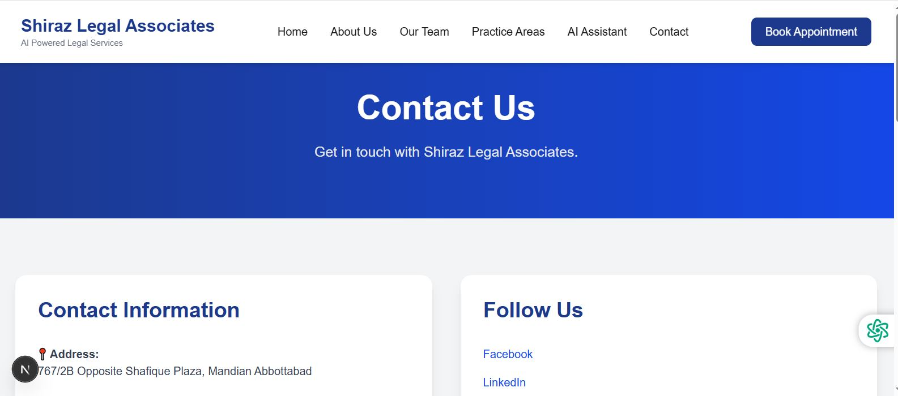

<div align="center">

# ⚖️ Shiraz Legal Associates AI

### AI-Powered Legal Assistance Platform for Pakistani Law

Built with ❤️ using **Next.js**, **Tailwind CSS**, **OpenRouter AI**, and **Vercel**


</div>

---

# 📖 About the Project

**Shiraz Legal Associates AI** is an AI-powered legal assistance web application developed to help people understand **Pakistani law** in a simple and accessible way.

Many people cannot easily access professional legal guidance because legal consultation is expensive or lawyers may not always be available. This application provides instant legal information through AI while encouraging users to seek professional legal advice whenever necessary.

---

# 🎯 Real Problem Solved

This application helps:

- Citizens looking for basic legal guidance
- Clients searching for legal services
- Students learning Pakistani law
- People who need quick answers before consulting a lawyer

Instead of searching through complex legal documents, users can simply ask the AI Assistant.

---

# 🌍 Live Website

## 🔗 Live Demo

**https://shiraz-legal-8s27p35vi-shirazlegalassociates-bytes-projects.vercel.app**

---

# ✨ Features

### 🏠 Home Page

- Modern landing page
- Professional law firm design
- Responsive layout

### 🤖 AI Legal Assistant

- Answers questions about Pakistani law
- Easy-to-understand explanations
- Professional legal guidance
- Rejects unrelated questions
- Copy AI response
- Clear chat feature
- Press Enter to send messages

### 👨‍⚖️ Website Pages

- Home
- About Us
- Practice Areas
- Our Team
- Contact
- Book Appointment

### 📞 Contact

- Contact information
- WhatsApp button
- Easy communication

### 📅 Appointment

- Online appointment booking form
- Client information collection

### ⭐ Additional Features

- FAQ Section
- Testimonials
- Responsive Navigation
- Footer
- Professional UI

---

# 🤖 AI Feature

The AI Assistant is designed specifically for **Pakistani Law**.

It can:

- Explain legal concepts
- Answer legal questions
- Guide users through legal procedures
- Recommend consulting professional lawyers
- Refuse unrelated questions

---

# 🧠 System Prompt

```text
You are Shiraz Legal Associates AI Assistant.

You are an expert in Pakistani law only.

Rules:

1. Answer only questions related to Pakistani law.
2. Explain legal concepts in simple English.
3. Mention Pakistani laws whenever possible.
4. Never provide false legal advice.
5. Never claim to be a licensed lawyer.
6. Recommend consulting a qualified advocate.
7. Reject non-legal questions.
8. Keep answers professional and concise.
```

---

# 🛠 Technologies Used

| Technology | Purpose |
|------------|----------|
| Next.js | Frontend Framework |
| React | UI Library |
| TypeScript | Programming Language |
| Tailwind CSS | Styling |
| OpenRouter API | AI Integration |
| Meta Llama 3.1 8B Instruct | AI Model |
| GitHub | Version Control |
| Vercel | Deployment |
| Visual Studio Code | Development |

---

# 📸 Screenshots

## 🏠 Home Page

> Add Screenshot Here



---

## 🤖 AI Assistant

> Add Screenshot Here



---

## 📅 Appointment Page

> Add Screenshot Here



---

## 📞 Contact Page

> Add Screenshot Here



---

# ⚙️ Installation

Clone the repository

```bash
git clone https://github.com/shirazlegalassociates-byte/shiraz-legal-ai.git
```

Go to project folder

```bash
cd shiraz-legal-ai
```

Install dependencies

```bash
npm install
```

Create

```text
.env.local
```

Add

```text
OPENROUTER_API_KEY=YOUR_OPENROUTER_API_KEY
```

Run the project

```bash
npm run dev
```

Visit

```text
http://localhost:3000
```

---

# 📂 Folder Structure

```
app/
 ├── about/
 ├── contact/
 ├── practice-areas/
 ├── team/
 ├── appointment/
 ├── api/
 └── components/

public/
```

---

# 🔐 Environment Variables

```
OPENROUTER_API_KEY
```

This secret key is stored securely in **Vercel Environment Variables** and is **never committed** to GitHub.

---

# 📈 Future Improvements

- User Authentication
- Client Dashboard
- Case Tracking
- Payment Integration
- File Upload
- AI Chat History
- Email Notifications
- Dark Mode
- Multi-language Support (English & Urdu)

---

# 👨‍💻 Developer

**Developed by Shiraz Legal Associates**

Academic Final Project

---

# 📜 License

This project is developed for educational purposes only.

It is not intended to replace professional legal advice.

---

<div align="center">

## ⭐ Thank You

If you like this project, please consider giving it a ⭐ on GitHub.

</div>
